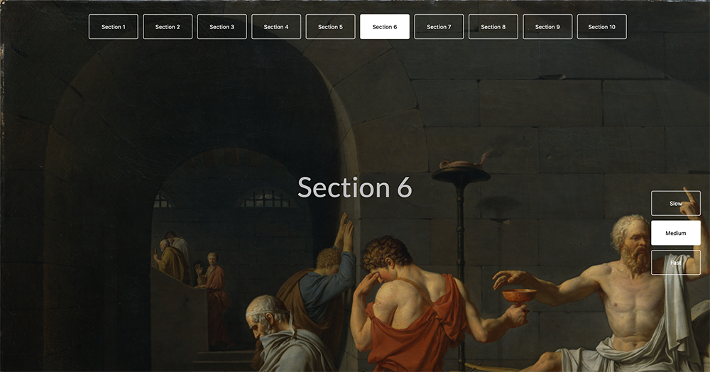

# Scroll js with speed options

Scroll scripts with javascript ES6+ with OOP elements. 



Add to buttons or links this line:

[Watch demo](https://haendzel.github.io/scrolloptions-js/) 📺 

```bash

onclick="goScroll('id')"

onclick="speedVal(40)"

```

| Technology stack I used in this project |
|--------------|
|HTML5 |
|CSS3 / Sass |
|Javascript with ES6 standard |
|Gulp |
|npm |


Big thanks who helps me with problem during development.
